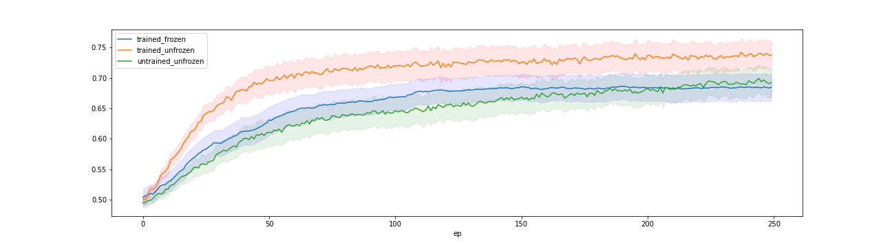
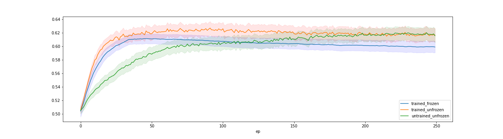
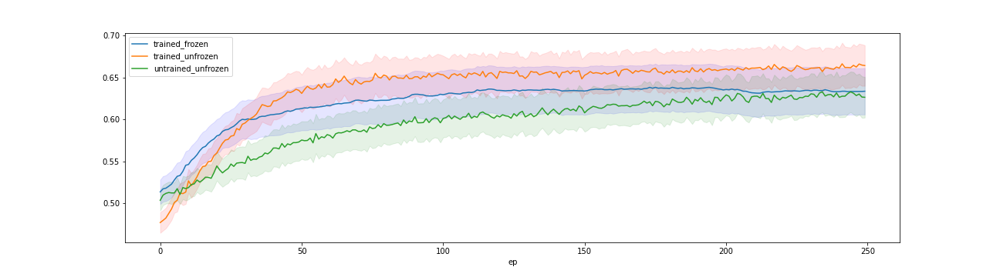

# Contrastive Pre-Training on MI EEG data

## Overview

This repo shows the results of contrastive pre-training for MI decoding from EEG data. We combined 12 public MI datasets into one. This project builds (heavily) on the this <a href=https://arxiv.org/abs/2206.08496>paper</a> and <a href=https://anonymous.4open.science/r/TFC-pretraining-6B07/README.md>code</a>

## Datasets

12 MI datasets were combined into one. We selected 7 EEG channels from each of the original MI datasets (using interpolation if there was )
12 MI datasets were combined into one. We selected 7 EEG channels (F3, F4, Fz, Cz, P3, P4, Pz) from each of the original MI datasets (using channel interpolation for some datasets as necessary). We chose these channels to maximize channel overlap across the MI datasets.

### Build the combined dataset

Use data-specific notebooks in `DATA2/` to fetch and pre-process each of hte MI datasets. Then use `JoinData.ipynb` to join the datasets into one file ready to use for pre-training and fine-tuning the models.

# Pre-training EEGNet with time-domain augmentations

We wanted to see if pretraining EEGNet (ref), a simple convolutional network that has been shown to perform well on MI classification, would benefit classification performance on target data. 

## Pre-train the EEGNet feature extractor

Use `EEGNet Contrastive Pretraining.ipynb` to pre-train the feature extractor.

## Notes

- For experiments 3 and 4 the `batch_size` is overridden and set to the size of the fine-tuning set

## 🔥Experiment 1. Within-Subject Transfer

Finetune on 1 subject's <a style="color:red">day 1</a>, test on <a style="color:red">day 2</a>

## Highlights

- `targetDsName = 'BNCI001-2014.pt'`
- `pretrain_dataset`: all datasets but the `targetDsName`
- `finetune_dataset`: ONE subject's session A from the `targetDsName`
- `test_dataset`:     that subject's session B from the `targetDsName`

`EEGNet Contrastive Pretraining.ipynb` plots the mean and standard deviation of evaluation losses in 3 scenarios:

- train the classifier attached to a **pre-trained but frozen** feature detector
- co-train the classifier attached to a **pre-trained but not frozen** feature detector
- train the classifier and feature detector **from scratch** (i.e. same as training EEGNet from scratch)

The curves below show the mean (over the subjects, and runs, 3 for each subject) test accuracy in the 3 scenarios

# 🔥Experiment 2: Cross-Subject Transfer

Fine-tune the feature extractor on all subjects in the target dataset except one held out, test on the held out one.

- `targetDsName = 'BNCI001-2014.pt'`
- `pretrain_dataset`: all datasets but the `targetDsName`
- `finetune_dataset`: all subjects in the `target_dataset` except one subject held-out from `target_dataset`
- `test_dataset`: the held-out subject from the `target_dataset`

# 🔥Experiment 3: "Few-Shot" Cross-Subject Transfer

Pre-train on the feature-extractor on datasets, finetune on _one_ subject in the target dataset, test on the rest of the subjects in the target dataset.

- `targetDsName = 'BNCI001-2014.pt'`
- `pretrain_dataset`: all datasets but the `targetDsName`
- `finetune_dataset`: the held-out subject from the `target_dataset`
- `test_dataset`: all the subjects in the `target_dataset` except one subject held-out from `target_dataset`

# 🔥Experiment 4. "Few-Shot" Within-Subject Transfer
Same as Experiment 1 but fine-tuning was done on 1/5 of Session A data, testing on Sess B

- `targetDsName = 'BNCI001-2014.pt'`
- `pretrain_dataset`: all datasets but the `targetDsName`
- `finetune_dataset`: 1/5 of Session A (day 1) trials (28 trials) of the held-out subject
- `test_dataset`: all the trials in Sesson B (Day 2) of the held-out subject from `target_dataset`

## License

MIT license.

